# Pytorch

[TOC]

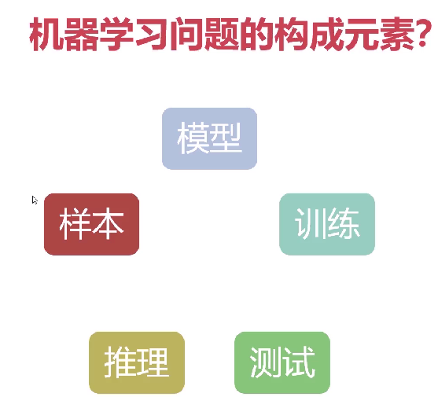


# Pytorch入门基础

## Tensor的创建


## Tensor的属性


```python
import torch

dev = torch.device('cpu')
a = torch.tensor([2, 2], dtype=torch.float, device=dev)
print(a)

> tensor([2., 2.])
```


## Tensor的稀疏张量


```python
import torch
# 确定稀疏张量中值的坐标，第一个列表为一维，第二个列表是二维，以此类推
i = torch.tensor([[0, 1, 2], [0, 1, 2]])
# 确定稀疏张量中值的大小
v = torch.tensor([1, 2, 3], dtype=torch.float)
# 生成稀疏张量，最后一个参数为稀疏张量的shape
a = torch.sparse_coo_tensor(i, v, (4, 4))
# 稀疏张量转化为紧凑张量
b = a.to_dense()
# 紧凑张量转化为稀疏张量
c = b.to_sparse_coo()

```


## Tensor的排序操作


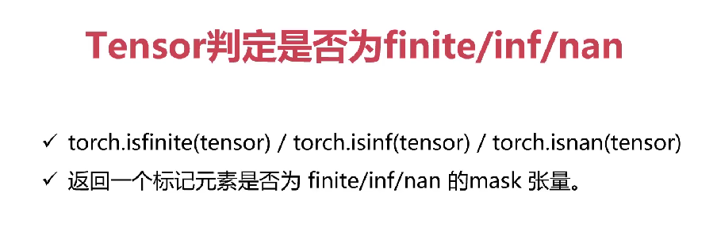

## Tensor的统计学相关操作

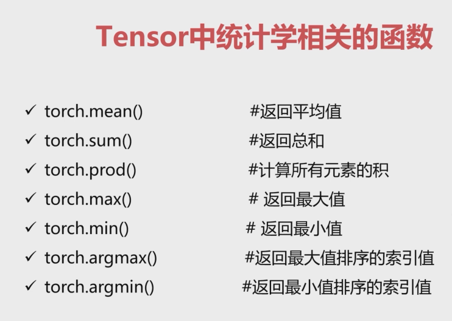


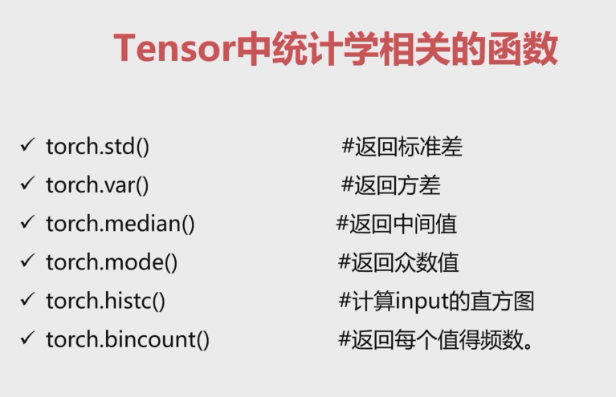


## Tensor中的分布函数


## Tensor中的随机抽样

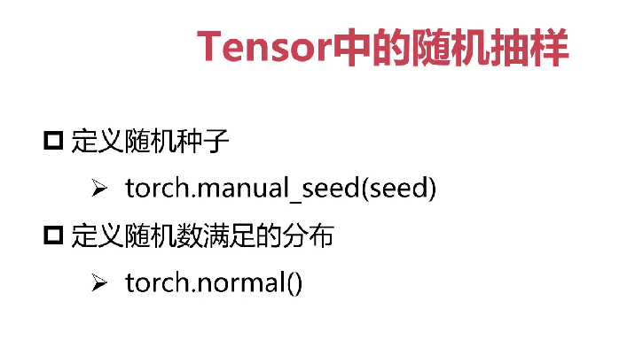

## Tensor中的范数运算


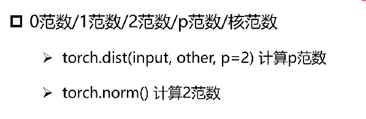

## Tensor中的矩阵分解

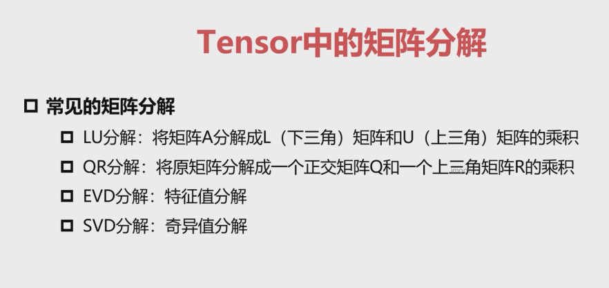

### PCA

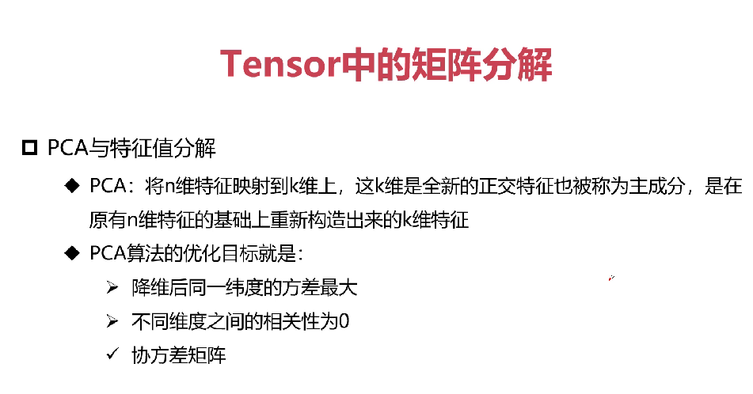

### LDA


## Tensor的张量剪裁

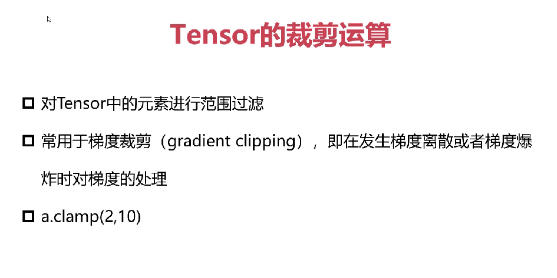

## Tensor的索引和数据筛选

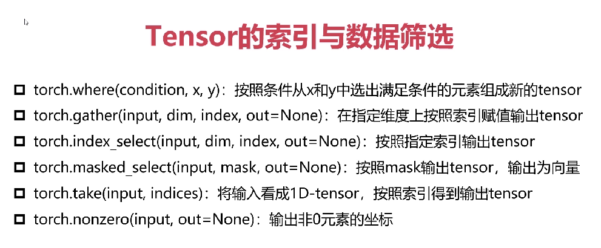

## Tensor的组合/拼接

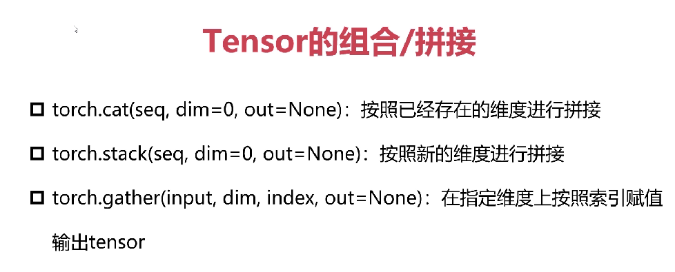

## Tensor的切片

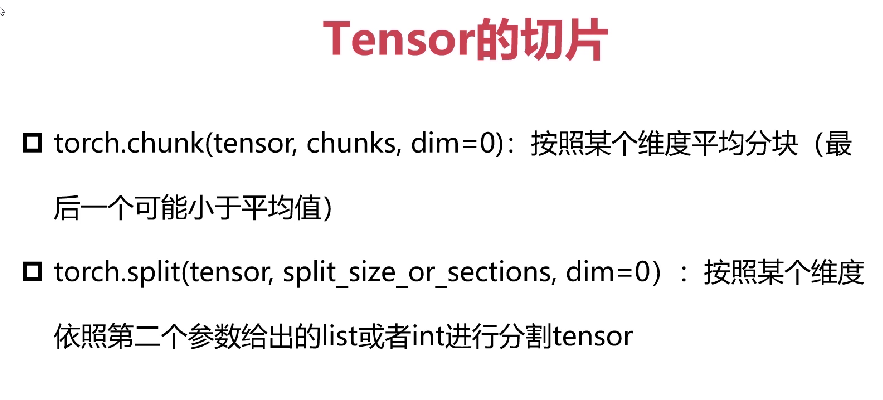

## Tensor的变形


## Tensor的填充与傅里叶变换

### 填充


### 频谱

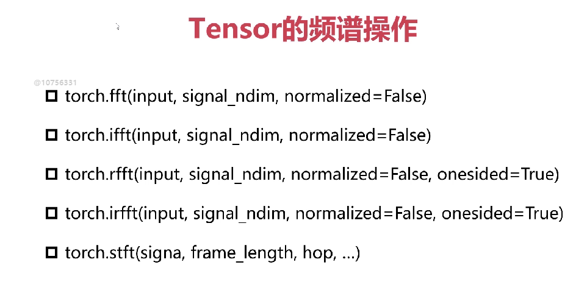

## Pytorch简单编程技巧

### 模型的保存与加载

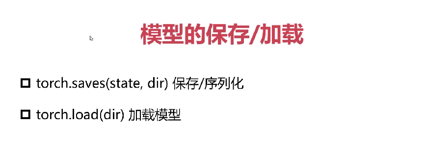

### 并行化

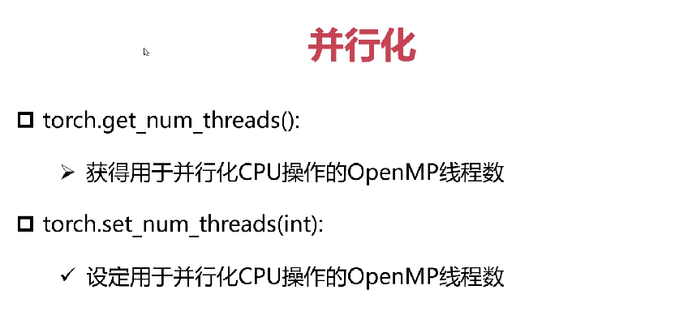

### Tensor与numpy的相互转化

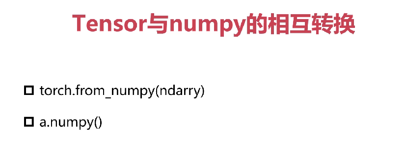

## Pytorch与autograd

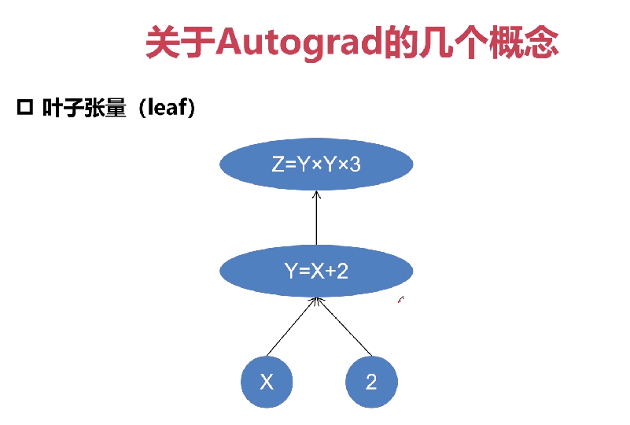


## torch.nn库


# 神经网络

## 基本概念


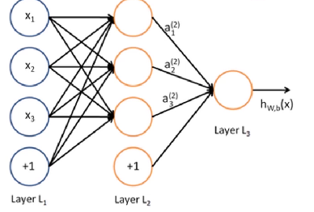


### 前向运算

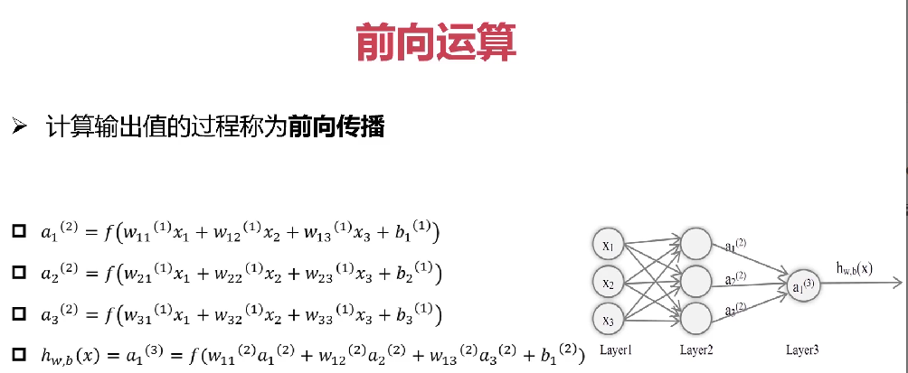


### 反向传播

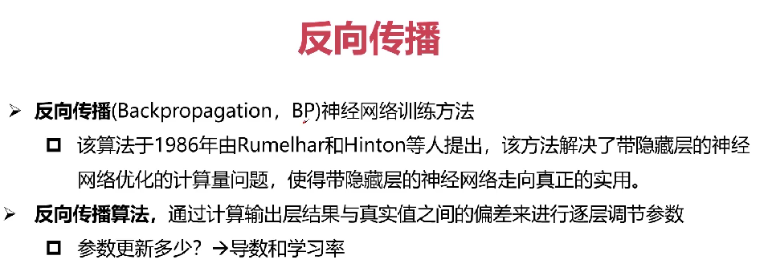


## 利用神经网络解决分类和回归问题

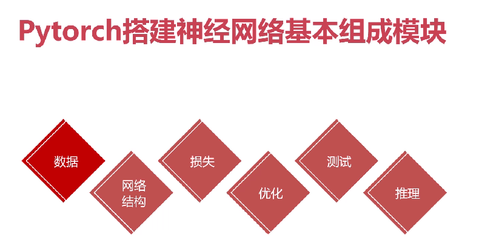


