# Pytorch

[TOC]


# Pytorch入门基础

## Tensor的创建

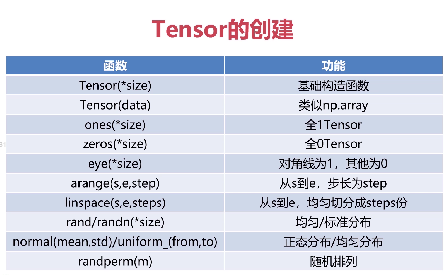


## Tensor的属性

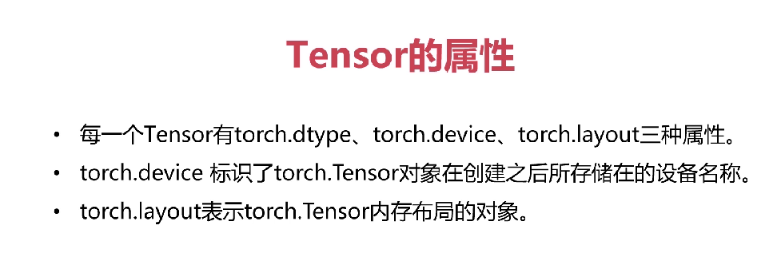

```python
import torch

dev = torch.device('cpu')
a = torch.tensor([2, 2], dtype=torch.float, device=dev)
print(a)

> tensor([2., 2.])
```


## Tensor的稀疏张量

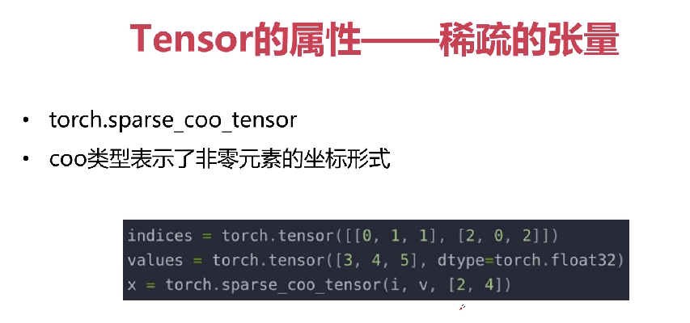

```python
import torch
# 确定稀疏张量中值的坐标，第一个列表为一维，第二个列表是二维，以此类推
i = torch.tensor([[0, 1, 2], [0, 1, 2]])
# 确定稀疏张量中值的大小
v = torch.tensor([1, 2, 3], dtype=torch.float)
# 生成稀疏张量，最后一个参数为稀疏张量的shape
a = torch.sparse_coo_tensor(i, v, (4, 4))
# 稀疏张量转化为紧凑张量
b = a.to_dense()
# 紧凑张量转化为稀疏张量
c = b.to_sparse_coo()

```


## Tensor的排序操作


## Tensor的统计学相关操作


## Tensor中的分布函数

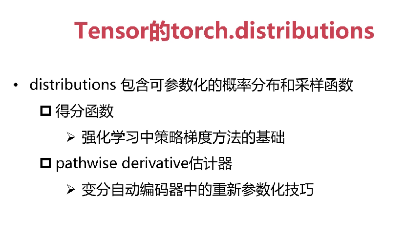

## Tensor中的随机抽样


## Tensor中的范数运算

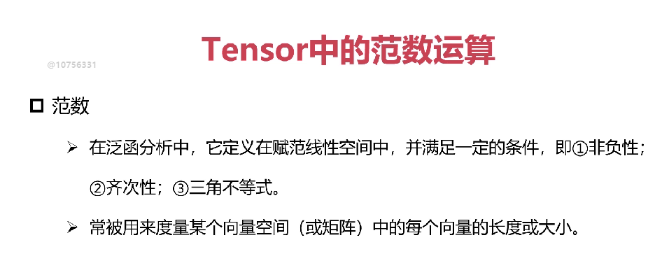


## Tensor中的矩阵分解


### PCA


### LDA

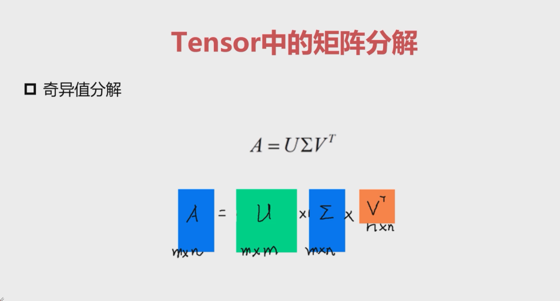


## Tensor的张量剪裁


## Tensor的索引和数据筛选


## Tensor的组合/拼接


## Tensor的切片


## Tensor的变形

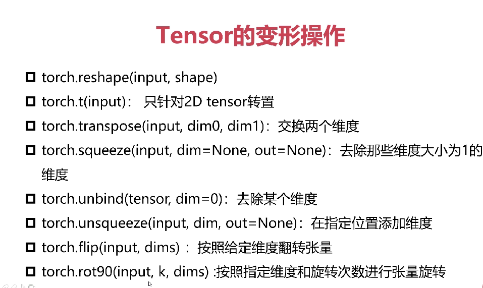

## Tensor的填充与傅里叶变换

### 填充

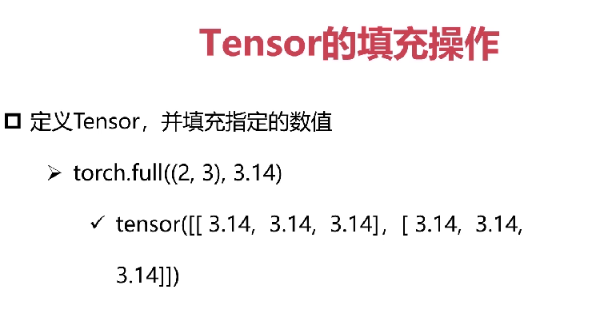

### 频谱


## Pytorch简单编程技巧

### 模型的保存与加载


### 并行化


### Tensor与numpy的相互转化


## Pytorch与autograd


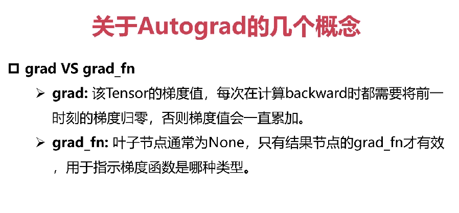

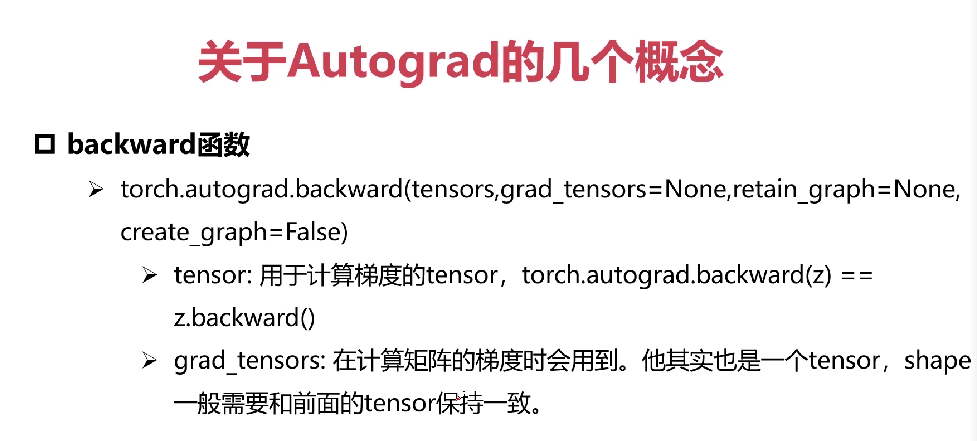

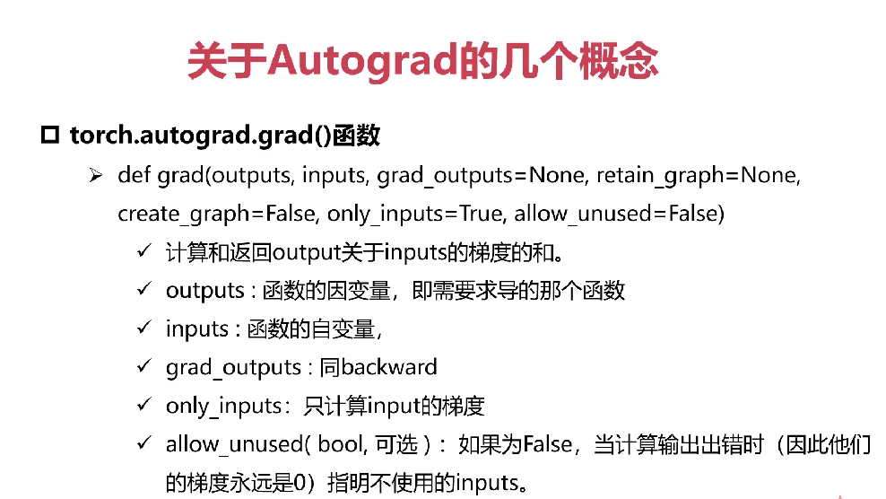

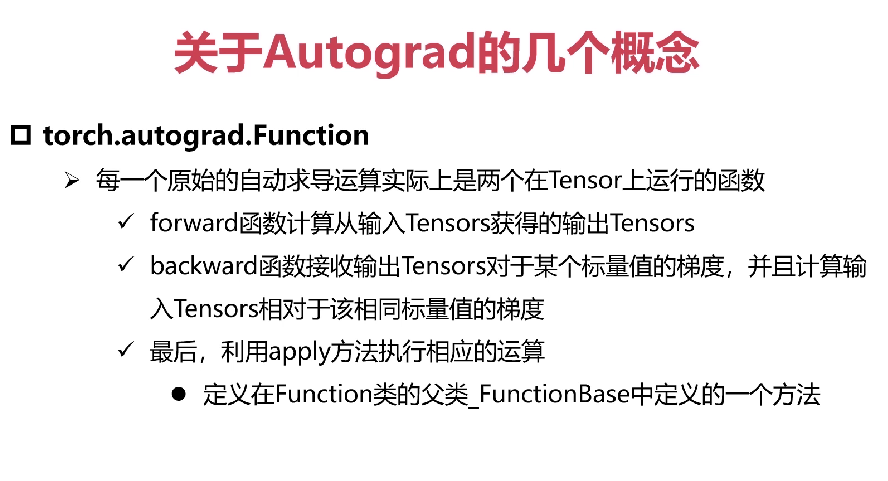


## torch.nn库


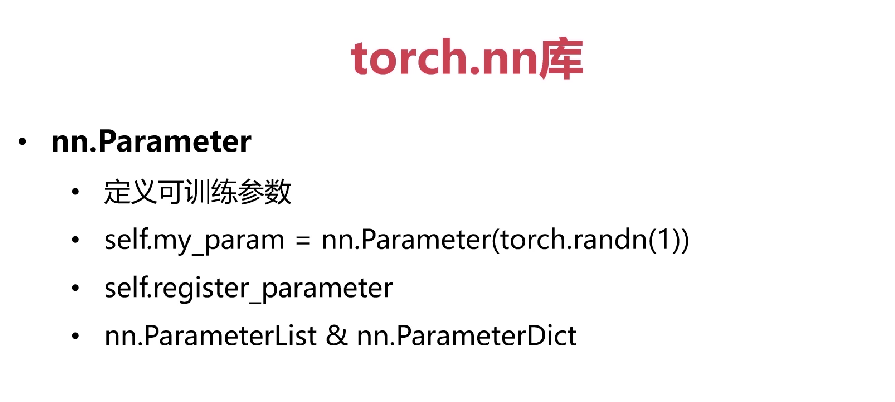


# 神经网络

## 基本概念


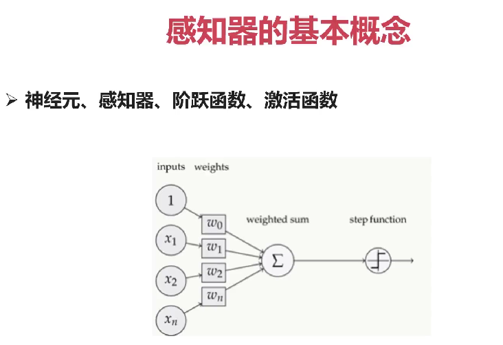


### 前向运算


### 反向传播


## 利用神经网络解决分类和回归问题


### 波士顿房价(经典回归问题)

```python
from tkinter import N
import torch
import numpy as np
import re
from sklearn.model_selection import train_test_split
# data——处理数据
data = open("data/housing.data").readlines()
data_list = []
for i in data:
    # 对每一行进行空格处理
    # 把多个空格变为一个空格
    out = re.sub(r"\s{2,}", " ", i).strip()
    data_list.append(out.split())

# 进行类型转换
data_list = np.array(data_list).astype(np.float)

# 进行数据切分(获得X和y)
X = data_list[:, 0:-1]
y = data_list[:, -1]
X_train, X_test, y_train, y_test = train_test_split(X, y, random_state=666)

# net(此处是简单的线性回归网络)


class Net(torch.nn.Module):
    def __init__(self, n_feature, n_output):
        super(Net, self).__init__()
        self.predict = torch.nn.Linear(n_feature, n_output)

    def forward(self, x):
        out = self.predict(x)
        return out


# 分别是X和y的维度
net = Net(X_train.shape[1], 1)

# loss(选择MSE——均方误差作为损失函数)
loss_func = torch.nn.MSELoss()

# optimiter(选择SGD——随机梯度下降法作为优化函数,lr为学习率)
optimiter = torch.optim.SGD(net.parameters(), lr=0.01)

# training
for i in range(1000):
    X_data = torch.tensor(X_train, dtype=torch.float)
    y_data = torch.tensor(y_train, dtype=torch.float)
    # 定义网络的前向运算
    pred = net.forward(X_data)
    # 进行pred的维度删除
    pred = torch.squeeze(pred)
    # 计算损失函数
    loss = loss_func(pred, y_data) * 0.001
    # 使用优化器，首先梯度为0
    optimiter.zero_grad()
    # 计算梯度
    loss.backward()
    # 进行更新
    optimiter.step()

    print(i, loss)
# test


# save(保存模型本身，或者保存模型参数)
torch.save(net, "model/housing_model.pkl")
# torch.load("")
# torch.save(net.state_dict(),"housing_params.pkl")
# net.load_state_dict("")

```

### 手写数字识别(经典分类问题)

```python
import torch
import torchvision.datasets as dataset
import torchvision.transforms as transforms
import torch.utils.data as data_utils


class CNN(torch.nn.Module):
    def __init__(self):
        super(CNN, self).__init__()
        self.conv = torch.nn.Sequential(
            torch.nn.Conv2d(1, 32, kernel_size=5, padding=2),
            torch.nn.BatchNorm2d(32),
            torch.nn.ReLU(),
            torch.nn.MaxPool2d(2)
        )
        self.fc = torch.nn.Linear(14 * 14 * 32, 10)

    def forward(self, x):
        out = self.conv(x)
        out = out.view(out.size()[0], -1)
        out = self.fc(out)
        return out


# data
train_data = dataset.MNIST(root="mnist",
                           train=True,
                           transform=transforms.ToTensor(),
                           download=True)

test_data = dataset.MNIST(root="mnist",
                          train=False,
                          transform=transforms.ToTensor(),
                          download=False)
# batchsize
train_loader = data_utils.DataLoader(dataset=train_data,
                                     batch_size=64,
                                     shuffle=True)

test_loader = data_utils.DataLoader(dataset=test_data,
                                    batch_size=64,
                                    shuffle=True)

cnn = CNN()
# loss

loss_func = torch.nn.CrossEntropyLoss()

# optimizer

optimizer = torch.optim.Adam(cnn.parameters(), lr=0.01)

# training
for epoch in range(10):
    for i, (images, labels) in enumerate(train_loader):
        images = images
        labels = labels

        outputs = cnn(images)
        loss = loss_func(outputs, labels)

        optimizer.zero_grad()
        loss.backward()
        optimizer.step()

    print("epoch is {}, ite is "
          "{}/{}, loss is {}".format(epoch+1, i,
                                     len(train_data) // 64,
                                     loss.item()))
    # eval/test
    loss_test = 0
    accuracy = 0
    for i, (images, labels) in enumerate(test_loader):
        images = images
        labels = labels
        outputs = cnn(images)
        # [batchsize]
        #outputs = batchsize * cls_num
        loss_test += loss_func(outputs, labels)
        _, pred = outputs.max(1)
        accuracy += (pred == labels).sum().item()

    accuracy = accuracy / len(test_data)
    loss_test = loss_test / (len(test_data) // 64)

    print("epoch is {}, accuracy is {}, "
          "loss test is {}".format(epoch + 1,
                                   accuracy,
                                   loss_test.item()))
torch.save(cnn, "model/mnist_model.pkl")

```


# 计算机视觉


## 计算机视觉的基本概念


### 颜色空间

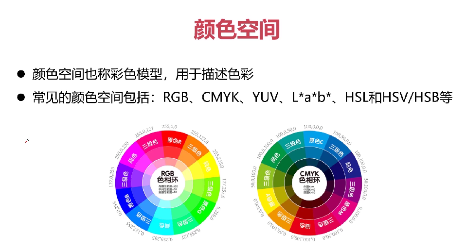

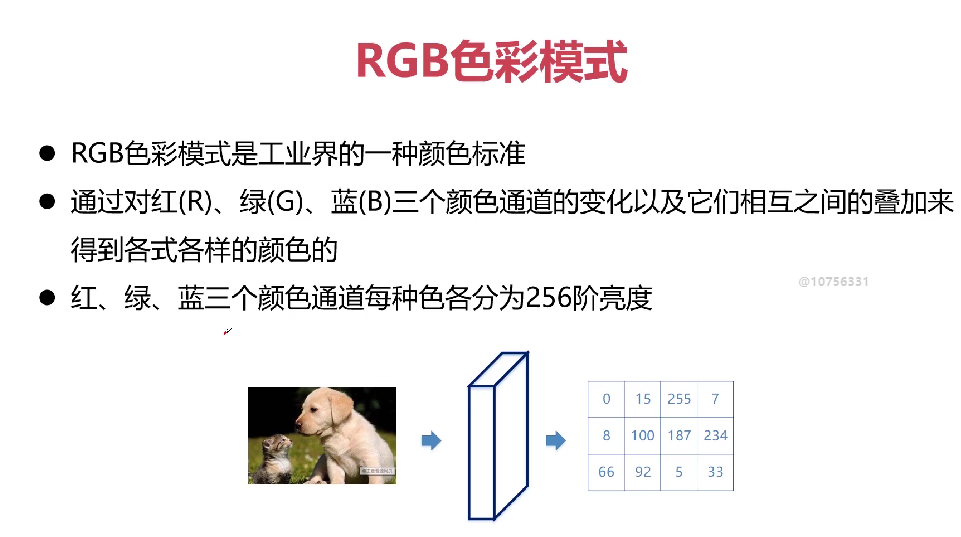

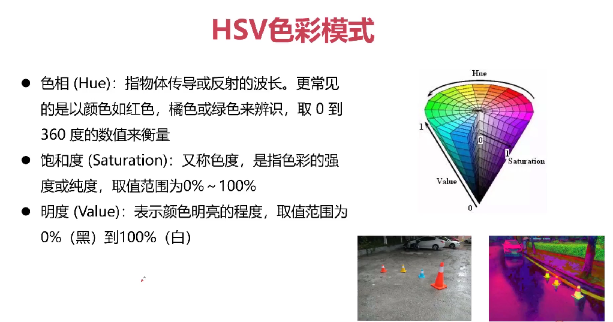

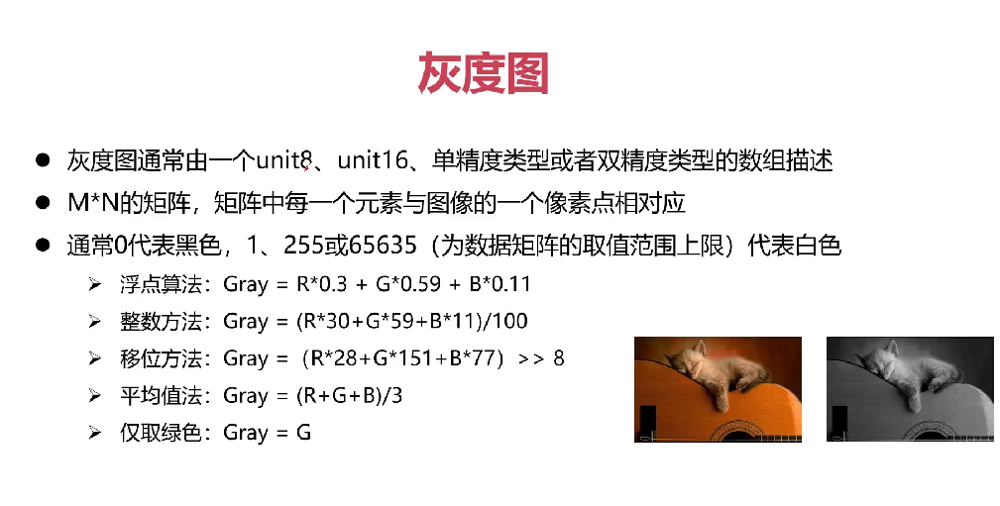

### 图像处理概念

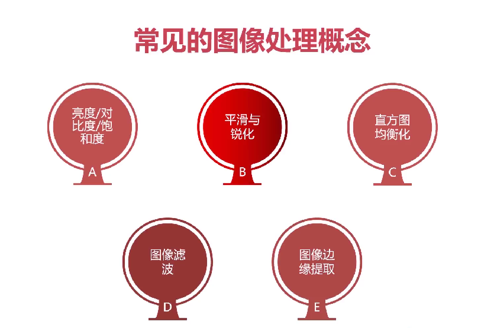

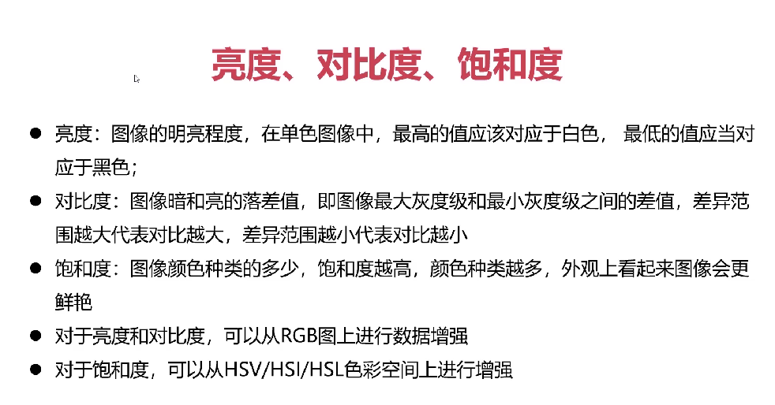

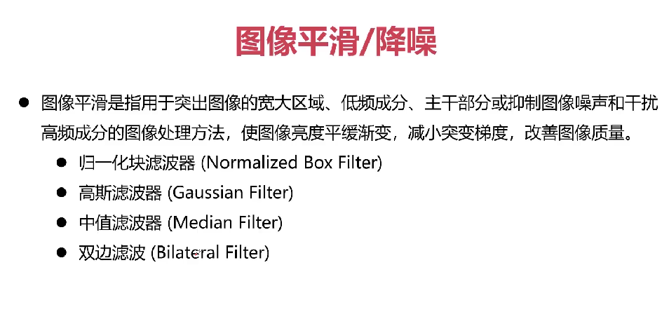

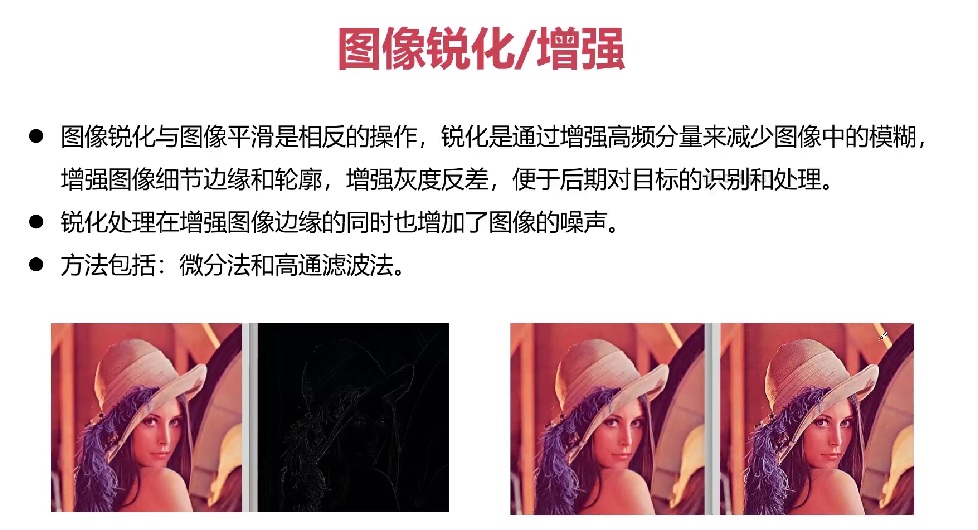

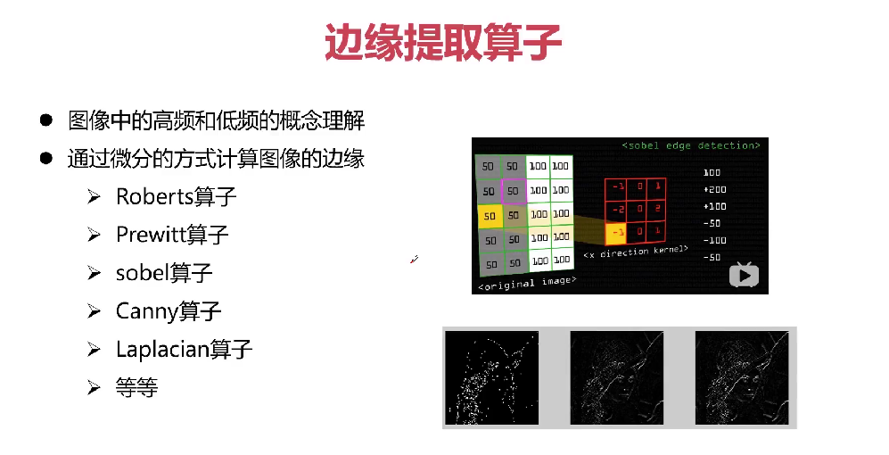


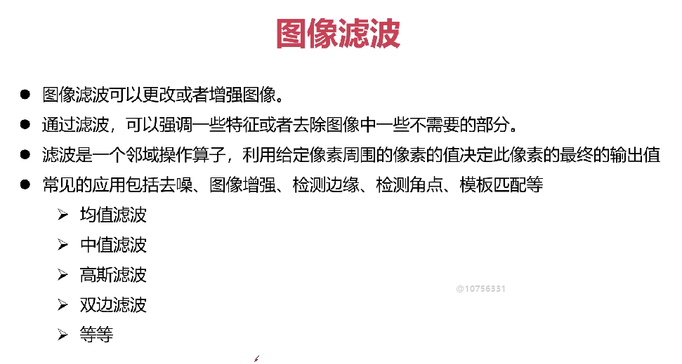

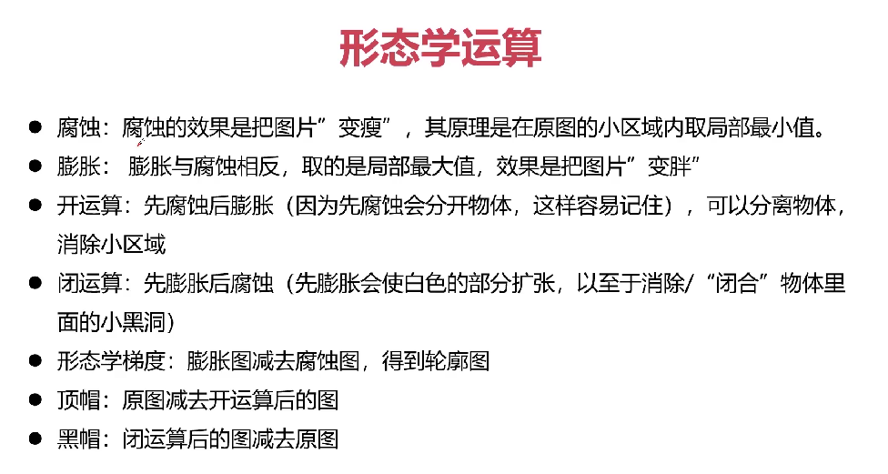

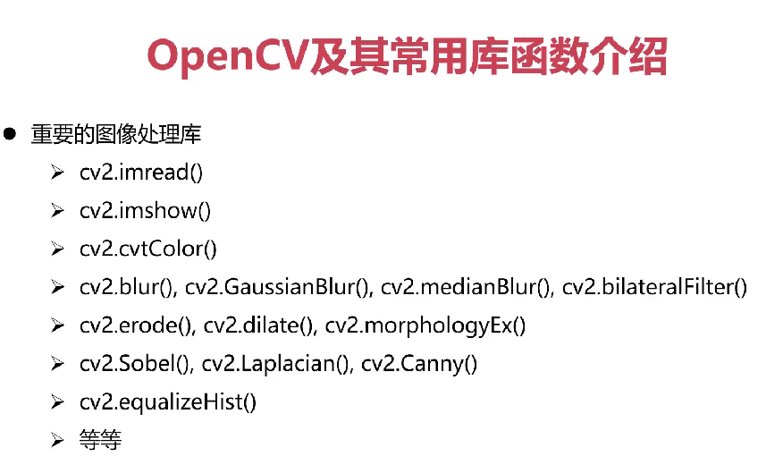


## 特征工程

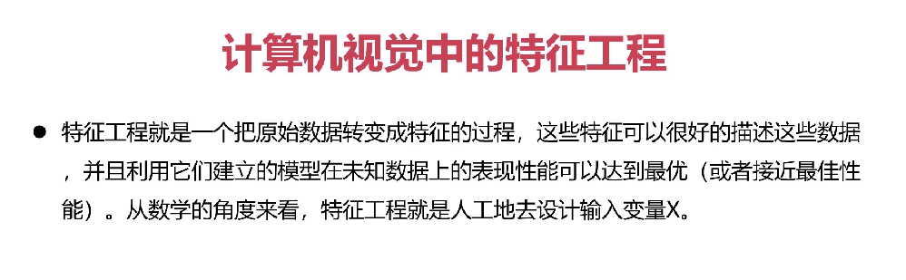

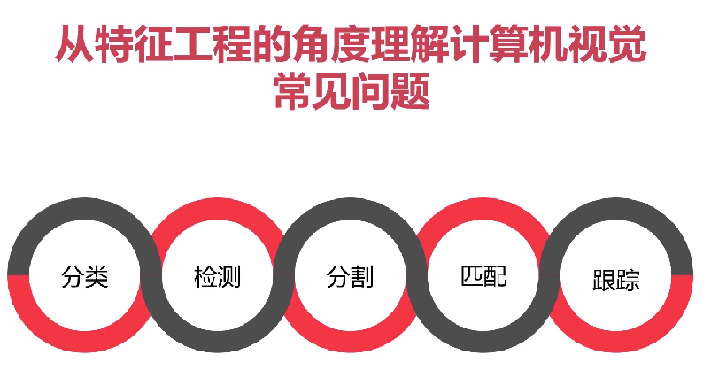


