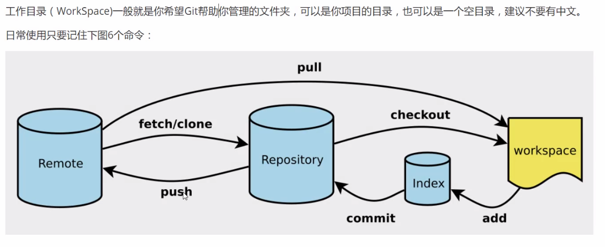

# Git

[TOC]


## 图形化展示结构




## 创建Git仓库


>  本地创建

```python
$ git init
```

执行完毕之后，在项目的根目录多出一个`.git`目录


> 远程克隆仓库

```python
$ git clone [url]
```


## Git文件操作


```python
# 查看指定文件的状态
git status [filename]

# 查看所有文件状态
git status

# 添加所有文件至暂存区
git add . 

# 提交暂存区中的内容到本地仓库
git commit -m "消息内容"

```


> 忽略文件

```python
# 为注释
*.txt		# 忽略所有 .txt结尾的文件，这样的话上传不会被选中
!lib.txt	# 上传除lib.txt除外的文件
/temp		# 仅忽略项目目录小的TODO文件，不包括其他目录temp
build/		# 忽略 build/目录下的所有文件
doc.*.txt	# 忽略 doc/notes.txt 但不包括 doc/server/arch.txt
```


> 设置本机绑定SSH公钥

```
# 进入 C:\Users\这是恩申的哟\.ssh
ssh-keygen -t rsa
```

再把生成的公钥注册至码云


## Git分支

git分支中常用的指令

```python
# 列出所有本地分支
git branch -r

# 创建新的分支，但是停留在当前分支
git branch [branch-name]

# 新建一个分支，并切换到该分支
git chechout -b [branch]

# 合并指定分支到当前分支
git merge [branch]

# 删除分支
git branch -d [branch-name]

# 删除远程分支
git push origin --delete [branch-name]
git branch -dr [remote/branch]

```

